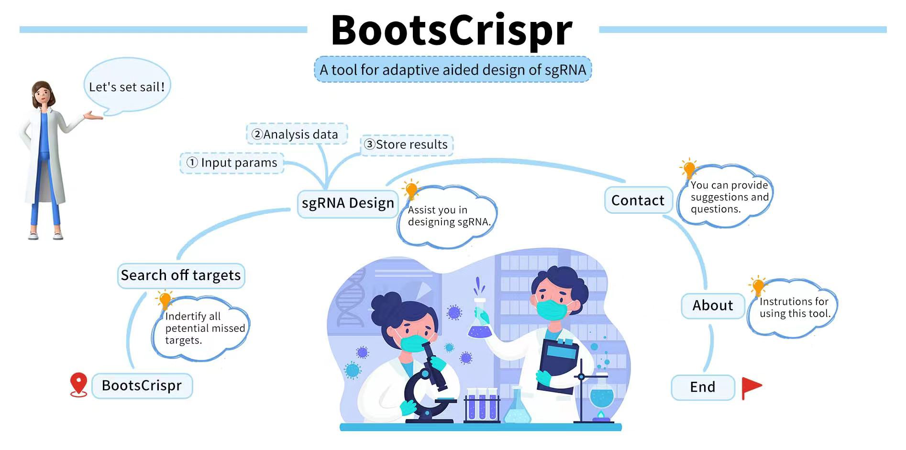
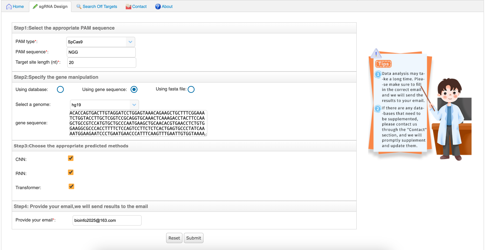
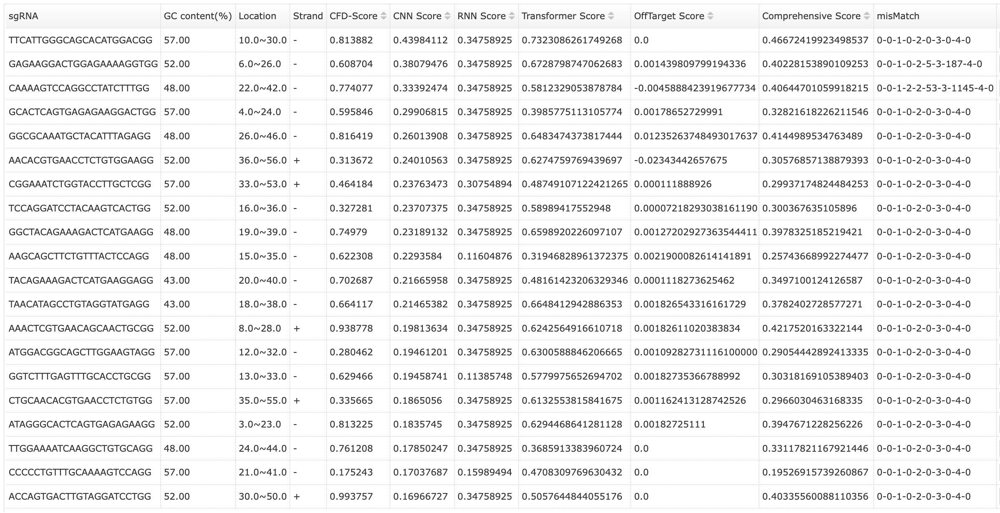
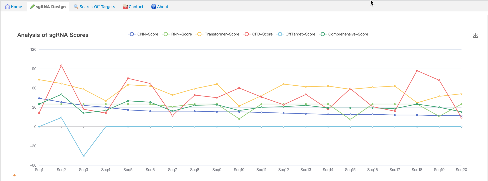
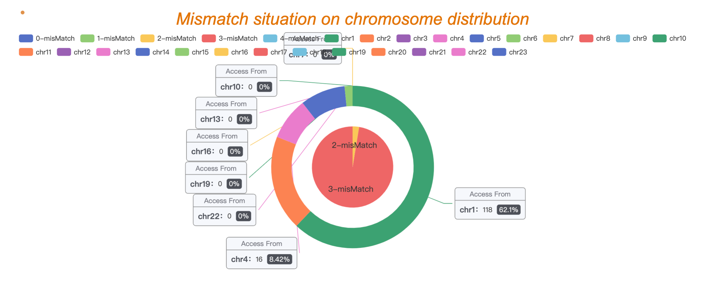
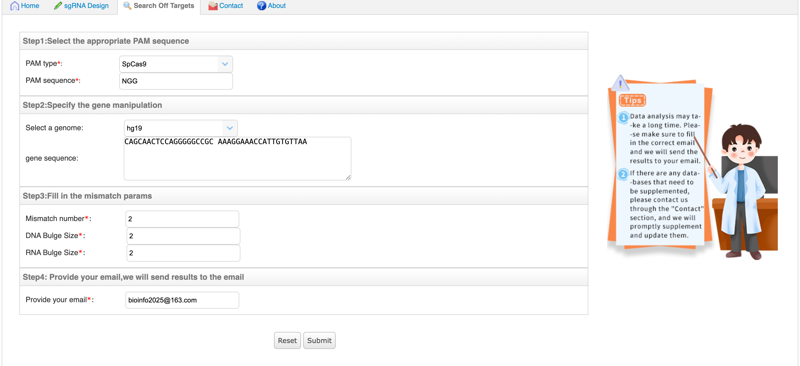
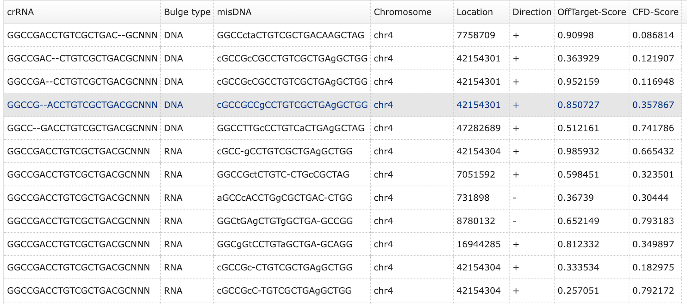
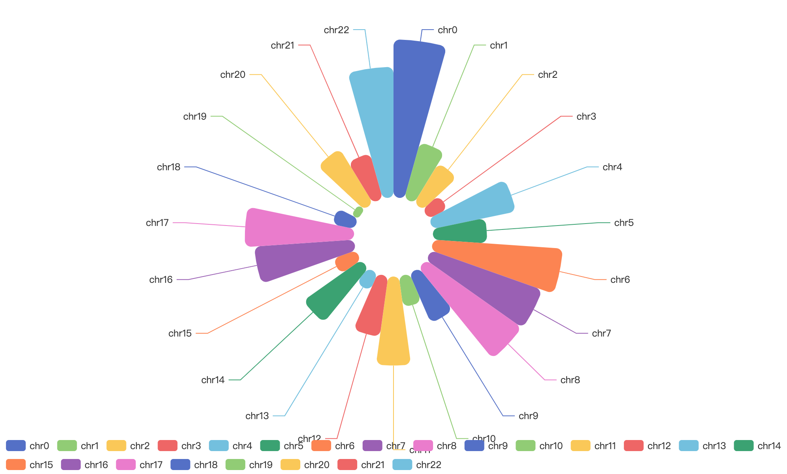
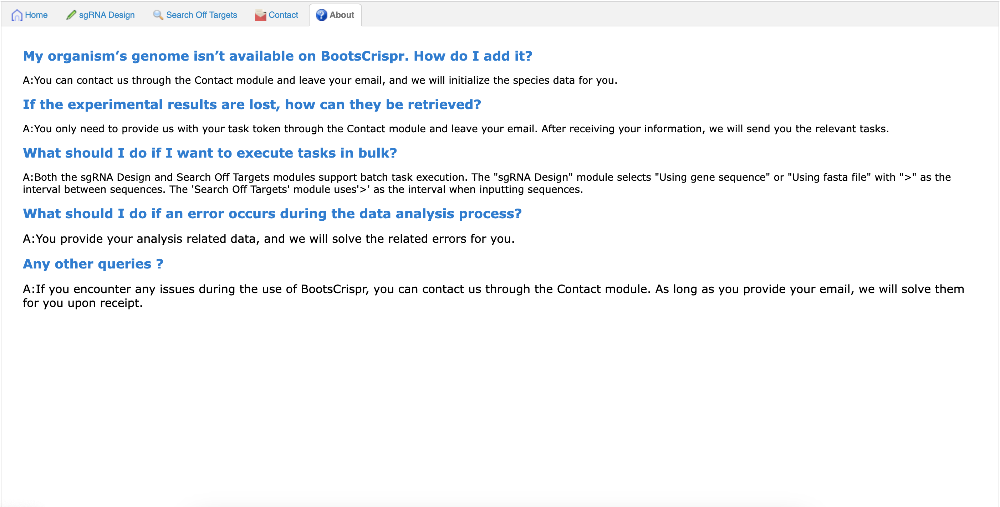

# BootsCrispr

## Introduction
BootsCrispr is a web-based tool used for sgRNA assisted design. In addition to assisting in sgRNA assisted design, it can
also search for potential off target locations within sequences.

The current version is compatible with three network models: CNN, RNN, and Transformer.

 
 
## Requirement
* django=3.2.15
* python == 3.7
* tensorflow == 1.13.1
* sonnet == 1.9
* keras=2.2.4
* Cas-OFFFinder = 3.0

Note:
1. BootCrispr currently provides visual pages for users to use ;
2. In addition to conventional species, users can provide us with species information that needs to be initialized for user data analysis and design.

## Usage
1. home

2. sgRNA Design

3. Search Off Targets

4. About

#### Prediction
There are three models: RNN, Transformer, and off target models, including CNN network models.

## Citation

## Contacts
bioinfo2025@163.com
